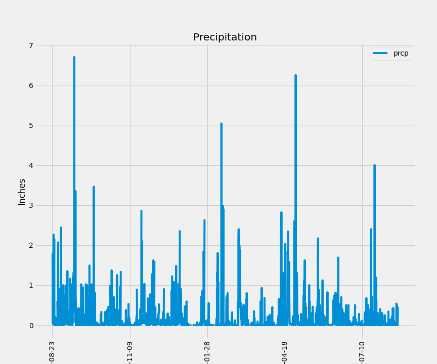
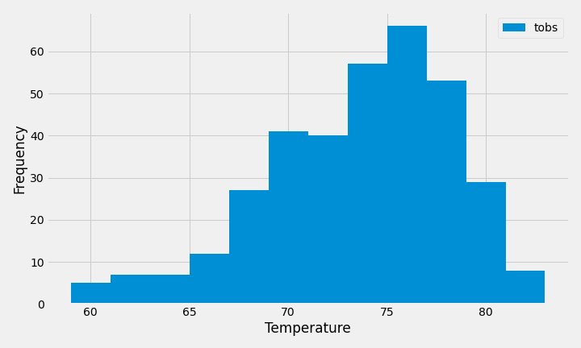
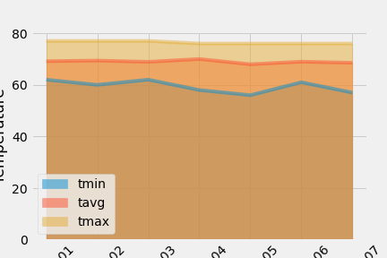
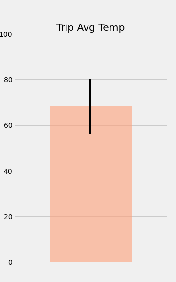

# SQLAlchemy_Challenge

## Overview

I've decided to treat myself to a long holiday vacation in Honolulu, Hawaii! To help with my trip planning, I need to do some climate analysis on the area. 

The Following was completed for my climate analysis:

* Used SQLAlchemy to reflect existing databases to classes in Python.
* Used queries to retrieve the past 12 months of precipitation data and put it into a DataFrame and plot the data.

* Used queries to retrieve the stations with the highest number of temperature observations 

* Used queries to find the daily averge rainfall.

### Bonus

## Temperature Analysis I

* Used a t-test to determine whether the difference in the means of the average temperatures in June and December
    * Found a p-value of `0.00036573` which means that there is no statistically significant difference of means. 

## Temperature Analysis II

* Used the `calc_temps` function to calculate the min, avg, and max temperatures for my trip using the matching dates from the previous year and plotted this data.

